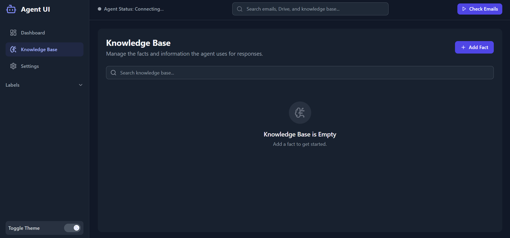
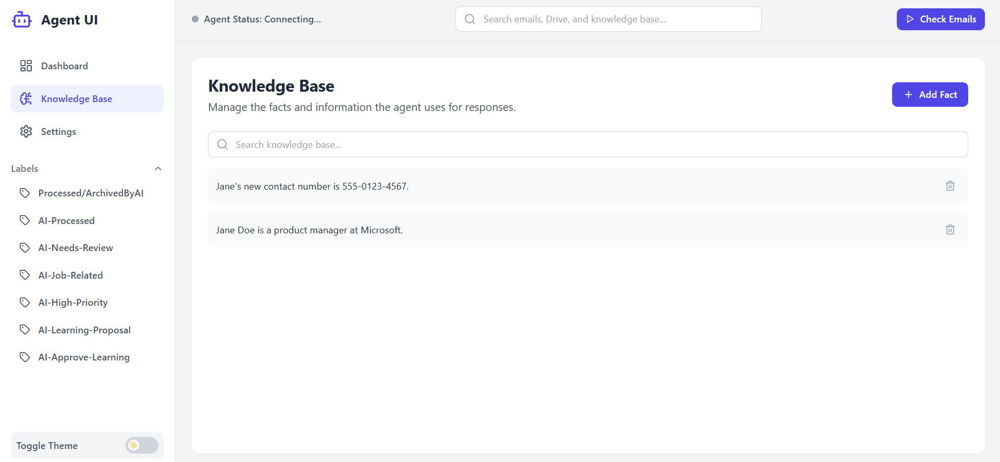
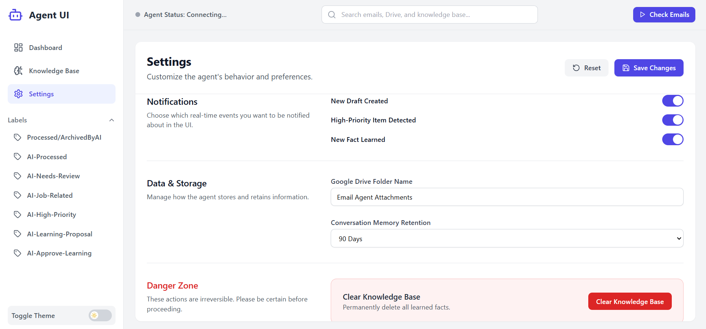
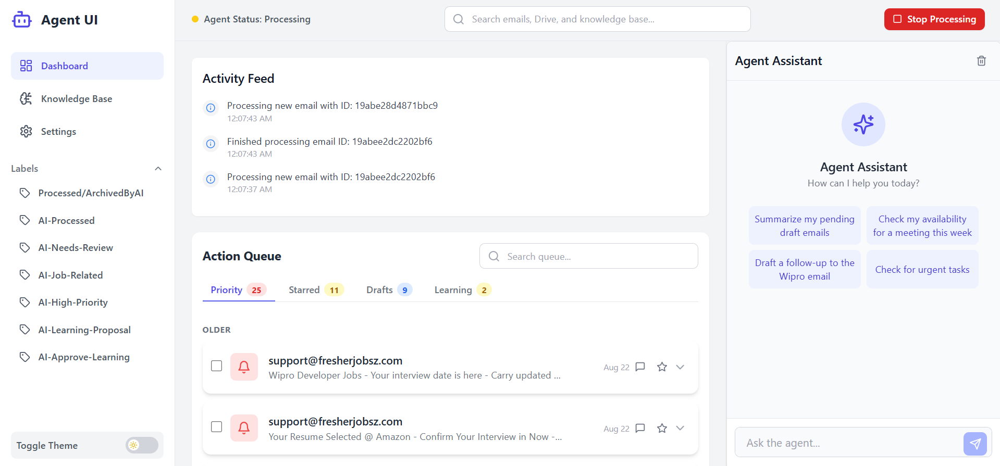
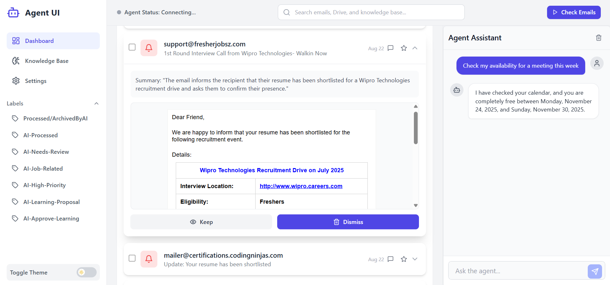
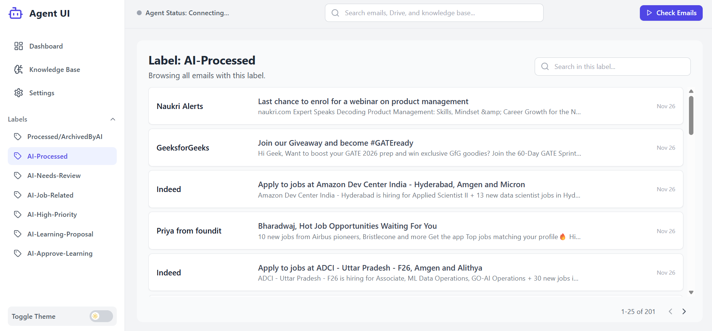
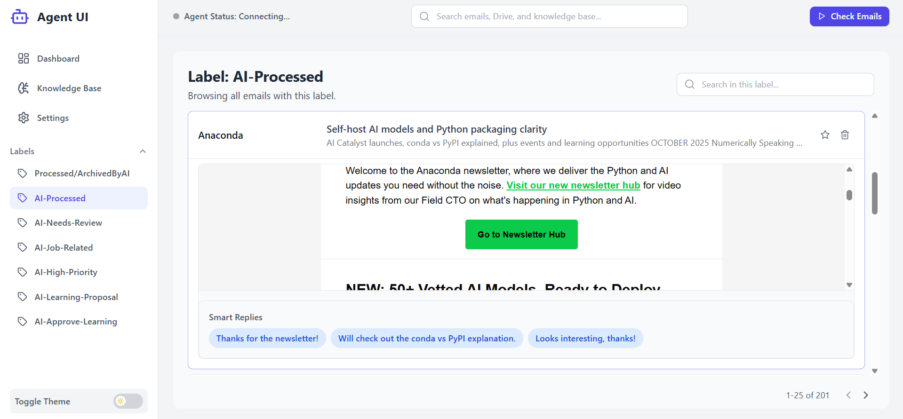
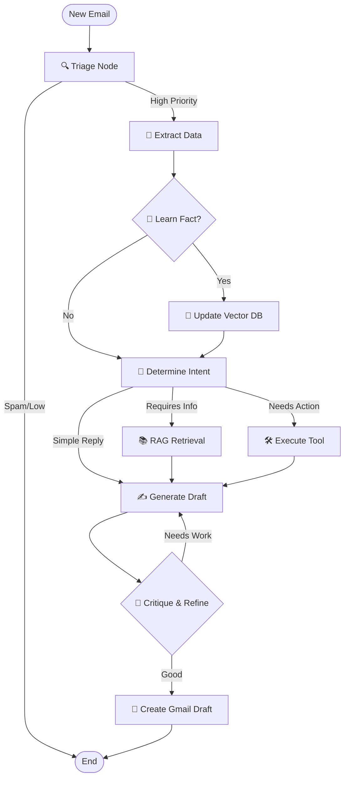

# Intelligent Personal Agent for Email Automation 🤖📧

**An Autonomous, Graph-Based Email Agent powered by Google Gemini, LangGraph, and RAG.**

[](https://opensource.org/licenses/MIT)
[](https://www.python.org/downloads/)
[](https://fastapi.tiangolo.com)
[](https://reactjs.org/)

---

## 🚀 Project Overview

**Intelligent Personal Agent** is not just an email client; it's an intelligent **agent** that lives in your inbox. Unlike traditional automation tools that follow rigid rules, this project uses a **Cognitive Architecture** based on **LangGraph** to reason, plan, and execute complex workflows.

It autonomously monitors your Gmail, triages incoming messages based on priority and context, drafts personalized replies using your personal knowledge base (RAG), and even manages your calendar—all while learning from your feedback to improve over time.

### 📸 Interface Preview

| 1. Knowledge Base (Dark) | 2. Knowledge Base (Light) |
|:---:|:---:|
|  |  |

| 3. Settings Page | 4. Dashboard Overview |
|:---:|:---:|
|  |  |

| 5. Chat Interface | |
|:---:|:---:|
|  | |

| 6. Email List | 7. Action & Detail View |
|:---:|:---:|
|  |  |

---

## 🛠️ Tech Stack

### Backend
- **Framework**: FastAPI (Async Python)
- **Orchestration**: LangChain & LangGraph
- **LLM**: Google Gemini 2.5 Flash
- **Vector Database**: Pinecone
- **Storage**: Google Cloud Firestore (NoSQL)
- **Search**: Tavily AI (Web), Google Drive API

### Frontend
- **Framework**: React (Vite)
- **Styling**: TailwindCSS
- **State Management**: React Hooks & Context
- **Icons**: Lucide React

---

## 🏗️ System Architecture

The core of the system is a **State Graph** (built with LangGraph) that orchestrates the agent's decision-making process.



---

## 💡 Technical Deep Dive

### 1. Graph-Based Orchestration (LangGraph)
Instead of a linear chain (A -> B -> C), this project uses a **Cyclic Graph**. This allows the agent to:
- **Loop**: If a generated draft doesn't meet quality standards, the `Critique` node sends it back to the `Generator` for revision.
- **Branch**: Dynamically decide whether to call a tool (Calendar), search the web (Tavily), or query the internal knowledge base (Pinecone).
- **Persist State**: The state of every email processing run is tracked, allowing for debugging and "human-in-the-loop" interventions.

### 2. Retrieval-Augmented Generation (RAG)
To avoid generic AI responses, the system maintains a **Personal Knowledge Base**.
- **Ingestion**: Facts are extracted from emails or manually added to `personal_faq.txt`.
- **Storage**: Embeddings are generated using `models/embedding-001` and stored in a **Pinecone Serverless Index**.
- **Retrieval**: When drafting a reply, the agent semantically searches this index to find relevant context (e.g., "My resume link is...", "I am available on...").

### 3. Federated Search
The `/api/search` endpoint implements a federated search pattern, querying three distinct data sources in parallel and aggregating the results:
- **Gmail**: Keyword search via Gmail API.
- **Drive**: Semantic and keyword search via Drive API.
- **Vector DB**: Semantic search for facts and learned preferences.

---

## 📂 Project Structure

A high-level overview of the backend organization, designed for modularity and scalability.

```
backend/
├── api.py                 # FastAPI entry point & WebSocket manager
├── config.py              # Centralized configuration & environment variables
├── knowledge_manager.py   # Background learning process manager
├── graph/                 # LangGraph workflow definitions
│   ├── nodes.py           # Core logic nodes (Triage, Extract, etc.)
│   ├── orchestrator.py    # Graph construction & compilation
│   └── state.py           # TypedDict state definitions
├── prompts/               # Prompt templates for LLM
├── services/              # Business logic & External integrations
│   ├── chat_agent_service.py  # Chat logic for UI interaction
│   ├── draft_service.py       # Manages email drafts
│   ├── firestore_service.py   # Google Firestore integration
│   ├── google_api_service.py  # Gmail, Drive, Calendar wrapper
│   ├── knowledge_base.py      # Pinecone & Firestore RAG service
│   ├── learning_service.py    # Extracts & proposes new facts
│   ├── memory_service.py      # Manages conversation history
│   ├── priority_service.py    # Handles high-priority items
│   ├── settings_service.py    # User preferences management
│   └── state_manager.py       # Manages processing state of emails
├── tools/                 # Agent capabilities (Tools)
│   ├── attachment_handler.py  # Processes email attachments
│   ├── chat_tools.py      # Tools exposed to the chat agent
│   ├── google_calendar.py # Calendar management tools
│   ├── knowledge_updater.py   # Tools for updating knowledge base
│   ├── tool_registry.py   # Dynamic tool discovery & registration
│   └── web_search.py      # Tavily search integration
├── knowledge_base/        # Local text files for initial RAG ingestion
└── utils/                 # Helper functions (Logging, Email Parsing)
```

---

## ⚡ Setup & Installation

### Prerequisites
- Python 3.10+
- Node.js v18+
- Google Cloud Project with Gmail, Calendar, and Drive APIs enabled.

### 1. Backend Configuration
```bash
cd backend
python -m venv venv
source venv/bin/activate  # or venv\Scripts\activate
pip install -r requirements.txt
```

Create a `.env` file:
```env
GOOGLE_API_KEY=your_gemini_key
PINECONE_API_KEY=your_pinecone_key
TAVILY_API_KEY=your_tavily_key
```

### 2. Frontend Configuration
```bash
cd frontend
npm install
npm start
```

---

## License

This project is licensed under the MIT License. You are free to use, modify, and distribute the software. For more details, see the `LICENSE` file.

---

## 👨‍💻 About the Developer

Built by **[madhyala-bharadwaj](https://github.com/madhyala-bharadwaj)**.

